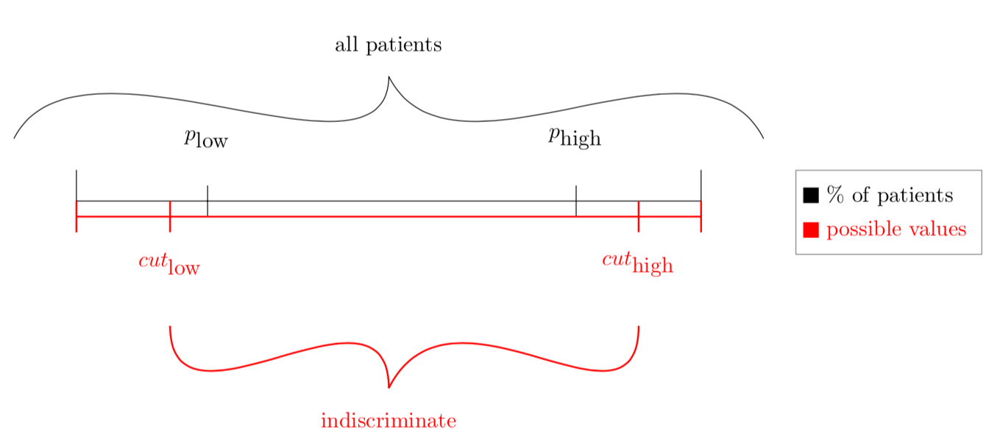
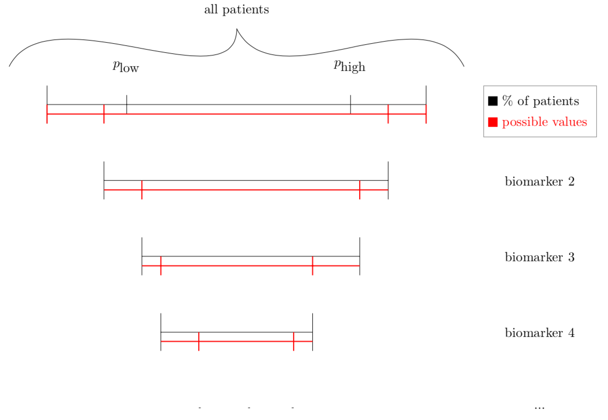
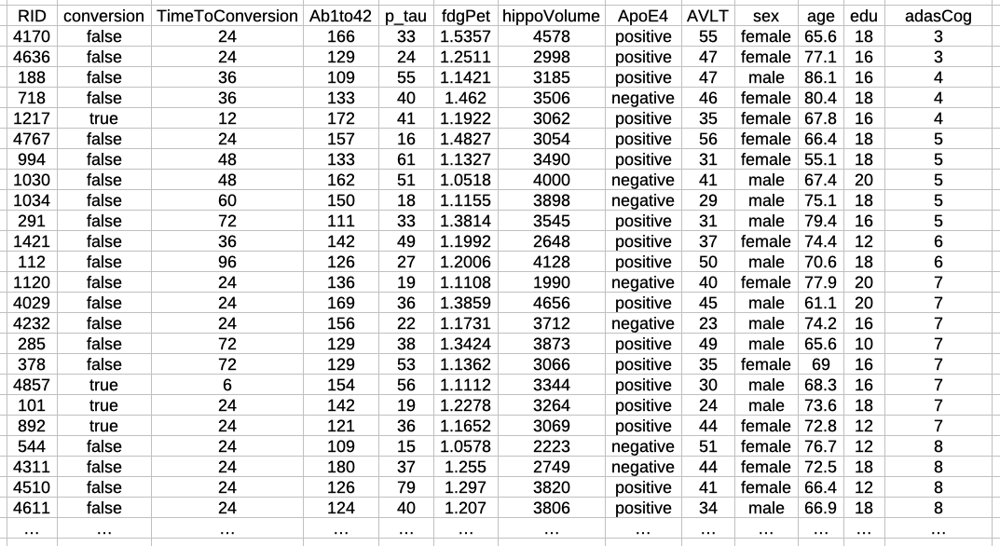

 
```{r, include=FALSE}
knitr::opts_chunk$set(collapse = TRUE, comment = "#>")
```
 
 
## Introduction
In a day and age, where more data per patient is collected and has to be evaluated, health care providers are starting to rely on clinical decision support systems (CDSS). The systems support health care providers by sifting through the patient data and suggesting further steps of treatment depended upon evidence based clinical guidelines [1]. 

The Triple Sec Algorithm is a clinical support algorithm for risk assessment of Alzheimer's disease (AD), which is the most common cause of a decline in mental ability, dementia [2]. 

Dementia is a general term, which is used to classify a group of neurodegenerative disease patterns [3]. These diseases are classified by a general decline in mental abilities caused by changes of the brain. The cause for the changes varies between the diseases though symptoms usually include problems with language, mood changes, disorientation and memory loss [3] which are often mistaken for normal aging due to the fact that most neurodegenerative diseases, including AD, are more common in patients over 65 years of age [4].

Alzheimer's disease is a highly complex disease which causes changes in the brain on a cellular and structural level. These changes can occur years before the first symptoms are visible [3]. The changes in the brain are irreversible, nor is the progression of AD stop able, though the treatments available today could temporarily improve symptoms [5]. To improve the patients life quality as much and for as long as possible, an early diagnosis is critical. Studies have also shown that early diagnosis and therefor early treatment increases the chances of the efficiency of the treatment [6]. 

According to current statistics over 50 million people are living with dementia today and a lot of them have not been diagnosed. Statistics estimate that someone in the world develops dementia every 3.2 seconds, leading to about 10 million new dementia cases each year [7]. Due to the growing and aging population demiological studies suggest the number of worldwide dementia patients will increase to over 130 million in 2050 [4].

Due to the number of cases there is an urgent need for early and reliable diagnosis. The problem with this is that the cause of Alzheimer's disease, thus the reason why the patients brain changes on a cellular and structural level is unknown. An additional problem is that the changes can only scarcely be detected without invasive and costly procedures due to the lacking consistency between different clinical, laboratory and imaging findings. For the task of singling out affected individuals with confidence we propose the created Triple Seq algorithm, which identifies patients dependent on user given risk thresholds by linking several predictors to the diagnostic procedure which are optimal to determine the given risk level, therefore categorizing the patients into risk categories dependent on their neurological symptoms. These categories, high risk, low risk and indiscriminate, represent the risk of the patient progressing to Alzheimer's disease, dependent on the given biomarker values in the completed examinations. The categories are defined by cutoff values of the biomarkers. These cutoff values are calculated dependent on user defined risk-threshold and ratio of patients. The algorithm allows healthcare providers to justify more invasive or more expensive treatment options for high risk converters [8]. 

## Alzheimer

"A degenerative disease of the brain characterized by the insidious onset of dementia. Impairment of memory, judgment, attention span, and problem solving skills are followed by severe apraxias and a global loss of cognitive abilities. [...]" - ICD 10 definition of Alzheimer [9]

Dementia is a general term, which is used to classify a group of neurodegenerative symptoms concerning language usage, mood changes, disorientation and memory loss [2,3]. The disease patterns lead to a significant impairment of everyday activities, causing patients to rely on others [3,4]. The diseases which evoke dementia are caused by brain changes on the cellular level leading to structural changes of the brain. These transformations are often caused by accumulations of misfolded, disease-specific proteins, though there are histopathological characteristic overlaps in many diseases [3]. For example about one third of Alzheimer's patients have transactivation response dna-binding protein deposits additional to the AD typical beta-amyloid beta and tau protein deposits [3].

Current statistics estimate that over 50 million people are living with dementia today , and also that someone in the world develops dementia every 3.2 seconds, which leads to an additional 10 million new dementia cases each year [7]. Due to the growing and aging population demiological studies suggest the number of worldwide dementia patients will increase to over 130 million in 2050 [4].

Alzheimer's disease (AD) is by far the most common form of dementia accounting for 60-80% of the cases [2]. 
Even though the disease affects so many people, the cause, for the deposits of misfolded proteins, is still unclear. There are various hypotheses ranging from genetic mutations to chronic inflammations [3,5]. The biggest risk factor is age as Alzheimer's is more common in patients over 65 years of age, which makes the diagnosis that much harder as the first signs of AD, such as short term memory loss and subtle problems with attentiveness, planning, abstract thinking, orientation and flexibility, are often mistaken for normal aging [10]. This intermediate stage between normal aging and an onset of dementia is called mild cognitive impairment (MCI) [3,4]. The course of progression of AD is usually categorized in three stages, early or mild, middle or moderate, and late or severe, with a continually decrease in cognitive and functional capabilities ending in the patients death [4].

### Diagnosis

The course of Alzheimer's dementia with the depositions of protein fibrils in the affected nerve cells, typically beta-amyloid and tau protein deposits, begins 10-15 years before the first symptoms become visible. Due to the fact that the cause of Alzheimer’s disease, thus the reason why the patients brain changes on a cellular and then structural level is unknown, it is difficult to detect these changes when they happen. Therfor healthcare professionals have to act quickly when the first symptoms become visible and the patient enters the stage of MCI. Though, during the stage of MCI, the symptoms are often mistaken for normal aging thefore often not being recognized by the patient nor by their treating physician. 
In general it is difficult to make a reliable diagnosis early on and be able to treat symptoms quickly and correctly. 
The only reliable and definitive way to diagnosis the patients brain for protein fibrils, though this is not possible while the patient is still alive. The changes can only scarcely be detected otherwise due to the lacking consistency between different clinical, laboratory and imaging findings therefore never creating a good base for them to justify their need for invasive tests.

The health care professionals are left with an exclusion procedure by doing these tests and ruling out other diseases which could cause the symptoms. 


## Triple Sec 

For the task of selecting patients that are affected by Alzheimer's disease with confidence we propose the created Triple Seq algorithm, which is a clinical support algorithm. It identifies patients by creating links between the preformed neurological and image test by means of a user given risk thresholds by linking several predictors to the diagnostic procedure which are optimal to determine the given risk level. 

The biomarker values resulting from the diagnostic procedures are the base for the designated risk levels which are categorized into three different categories. These categories are high risk, low risk and indiscriminate. The biomarker values are classified based on cut off values which are calculated dependent on user defined risk-threshold and ratio of patients. The algorithm allows healthcare providers to justify more costly or invasive treatment options for high risk converters [8].
 
### Algorithm flow
The TripleSec algorithm categorizes the patients into three categories depended upon their biomarker values. The user provides the algorithm with a data table including the patients which are supposed to be assessed and the biomarkers as well as two risk-threshold values, pHigh and pLow. The algorithm proceeds to iterate through all patients using all but one patient to calculate the cut off values and assesing the risk of conversion of the last patient. 
The calculation of the cutoff values is based upon the user given risk-threshold, pHigh and pLow. They represent the percentage of patients which are supposed to have a certain biomarker larger or equal to x (pHigh) or smaller or equal to x (pLow). 
During each iteration the biomarker value is decreased (pHigh) or increased (pLow) by 5% of the highest (pHigh) or lowest (pLow) value. The biomarker value which is the first value upon which the percentage of patients crosses the risk-threshold is used as the cut off value (cutHigh, cutLow) for that particular biomarker.
```{r, echo=FALSE, out.width="100%"}

```
This cut off value calculation is repeated for each biomarker given from the user in the data table. After each biomarker all patients that can be classified as high risk or low risk, therfor their values are higher or equal to cutHigh or below or equal to cutLow, are excluded from the next biomarker cut off caluculation. This allows the algorithm to focus on the indiscriminate ("unkown risk") section and classifying more patients during each iteration. 
```{r, echo=FALSE, out.width="100%"}

```


### Preinstallation
TripleSec depends on one package. 
[readr](https://cran.r-project.org/web/packages/readr/index.html)

Please ensure to install the readr package before using the TripleSec package to ensure the data file used as inputData can be processed. 

### Installation via GitHub
```{r setup, eval=FALSE}
require(readr)
install_github("zaynabhammoud/TripleSec")
library(TripleSec)
```

### Available Functions

#### pruneTree
**calculate cutOff table for given data**

This function divides the given input data frame into training and test data. All patients but one are used as training data and are used in the function calCutOff, which returns a matrix containing the calculated cut off values. Using this matrix and the test patient, pruneTree then calls predictTree. This function asseses the risk of conversion for the test patient. 

The function pruneTree returns a variable result with a link to a table containing the average cutoff values for each feature and a data table with the patients and feature and their risk assessment, once it has iterated through all input data and using each patient as a test patient. The risk assessment is an additional column for each biomarker which is added in the function with the values 1 for a high conversion risk and 0 otherwise.

The function requires the following arguments:

- **inputData** - The prepared input data. The data can be prepared via the function `prepareData(data, firstFeature, featureList)`
- **pHigh** - The high risk threshold
- **pLow** - The low risk threshold


***Example***
```{r, eval=FALSE}
inputData <- prepareData(data, firstFeature, featureList)
pHigh <- 0.8 
pLow <- 0.2
result <- pruneTree(inputData, pHigh, pLow)
```


#### calCutOff
**Sequential training of the algorithm**  

This function is used to calculate the cut off values for low-risk and high-risk groups. 

The values are calculated by the proportion between converters with a value and all patients having this certain value corresponding with the given pHigh and pLow values. For each feature cutoff calculation all patients that have not been categorized into the high or low risk categories will be used.

The function calCutOff returns a variable fit, which contains links to the calculated cutOff table, filtered data and effectiveness of the cutOff values.

The function requires the following arguments:

- **inputData** - The prepared input data for training of the algorithm, which is provided by pruneTree.
- **pHigh** - The high risk threshold.
- **pLow** - The low risk threshold.


#### predictTree
**Sequential prediction of a patient conversion risk**

This function calls the recursive function predictTreeRec. The function returns a variable with a link to a patient data table containing their risk assessments and a link to the average cutoff value matrix.

The function predictTree returns a variable result with its links to the cutOff matrix and predicted patient information.

The function requires the following arguments:

- **cutoffValues** - The calculated cutOff values, which are provided by the function calCutOff.
- **inputData** - The inputData/the patient which is supposed to be predicted (provided by pruneTree).


#### predictTreeRec
**Sequential prediction of a patient conversion risk**

This recursive function calculates the cutoff value for each parameter dependent upon the patient ratio, it also verifies if the model is effective (cut_high > cut_low).

The function predictTreeRec returns a variable result with its links to the cutOff matrix and predicted patient information.

The function requires the following arguments:

- **cutoffValues** - The calculated cutOff values, which are provided by the function calCutOff.
- **inputData** - The inputData/the patient which is supposed to be predicted (provided by pruneTree).


#### prepareData
**Filters and transforms given data**

This function transforms the given data into a data frame containing only the columns necessary for the TripleSec algorithm, therefor for the risk assessment.

The function requires the following arguments:

- **data** - The data which is given by the user.
- **firstFeature** - The name of column containing the feature data which is most relevant. 
- **featureList** - A list contaning all column names of the features which the algorithm is supposed to work with.

***Example***
```{r, eval=FALSE}
inputData <- prepareData(dataFile.csv, "adasCog", c("fdgPet, p_tau"))
```


### Testing

The TripleSec algorithm was tested with a csv data file containing data of 144 individuals. 

```{r, echo=FALSE, out.width="100%"}

```

Using the function [prepareData](https://github.com/zaynabhammoud/TripleSec/blob/KAP/R/prepareData.R) with the csv file, firstFeature equaling "adasCog" and the featureList being c("fdgPet", "p_tau") the csv file was transformed into a data frame which then was used as inputData for pruneTree. 


```{r}
library(readr)
library(TripleSec)
dataAD <- read_csv("predictAD.csv")
firstFeature <- "adasCog"
featureList <- c("fdgPet", "p_tau")
inputData <- prepareData(dataAD, firstFeature, featureList)
pHigh <- 0.8 
pLow <- 0.2
result <- pruneTree(inputData, pHigh, pLow)
print(result$cutOff)
print(result$data)
```

## References
1. CDC. How to Implement Clinical Decision Support Systems [Internet]. Centers for Disease Control and Prevention. 2021 [cited 12. August 2021]. available on: https://www.cdc.gov/dhdsp/pubs/guides/best-practices/clinical-decision-support.htm

2. Dementia vs. Alzheimer’s Disease: What is the Difference? [Internet]. Alzheimer’s Disease and Dementia. [cited 12. August 2021]. available on: https://alz.org/alzheimers-dementia/difference-between-dementia-and-alzheimer-s

3. Sturm D, Biesalski A-S, Höffken O, Herausgeber. Neurologische Pathophysiologie: Ursachen und Mechanismen neurologischer Erkrankungen [Internet]. Berlin, Heidelberg: Springer Berlin Heidelberg; 2019 [cited 29. August 2021]. available on: http://link.springer.com/10.1007/978-3-662-56784-5

4. Frost C. Molecular Dynamics Simulation: Applications from Alzheimer’s Disease to Photopharmacology. :208 

5. Alzheimer-Krankheit. In: Wikipedia [Internet]. 2021 [cited 19. August 2021]. available at: https://de.wikipedia.org/w/index.php?title=Alzheimer-Krankheit&oldid=214843556


6. Alzheimer verstehen [Internet]. [cited 12. August 2021]. available on: https://www.alzheimer.de/

7. ADI - Dementia statistics [Internet]. [cited 12. August 2021]. available on: https://www.alzint.org/about/dementia-facts-figures/dementia-statistics/


8. Early probability-driven prediction of disease progression: a new algorithm applied to Alzheimers disease. :13. 

9. 2021 ICD-10-CM Codes G30*: Alzheimer’s disease [Internet]. [cited 30. August 2021]. available at: https://www.icd10data.com/ICD10CM/Codes/G00-G99/G30-G32/G30-

10. What is Alzheimer’s? [Internet]. Alzheimer’s Disease and Dementia. [cited 19. August 2021]. available at: https://alz.org/alzheimers-dementia/what-is-alzheimers

11. Ren J. Automated Detection of Early-Stage Alzheimer’s Disease. :94. 

12. Sperling RA, Aisen PS, Beckett LA, Bennett DA, Craft S, Fagan AM, u. a. Toward defining the preclinical stages of Alzheimer’s disease: Recommendations from the National Institute on Aging-Alzheimer’s Association workgroups on diagnostic guidelines for Alzheimer’s disease. Alzheimers Dement. May 2011;7(3):280–92. 

13. HealthITSecurity. Understanding the Basics of Clinical Decision Support Systems [Internet]. HealthITAnalytics. 2017 [cited 29. August 2021]. available on: https://healthitanalytics.com/features/understanding-the-basics-of-clinical-decision-support-systems


